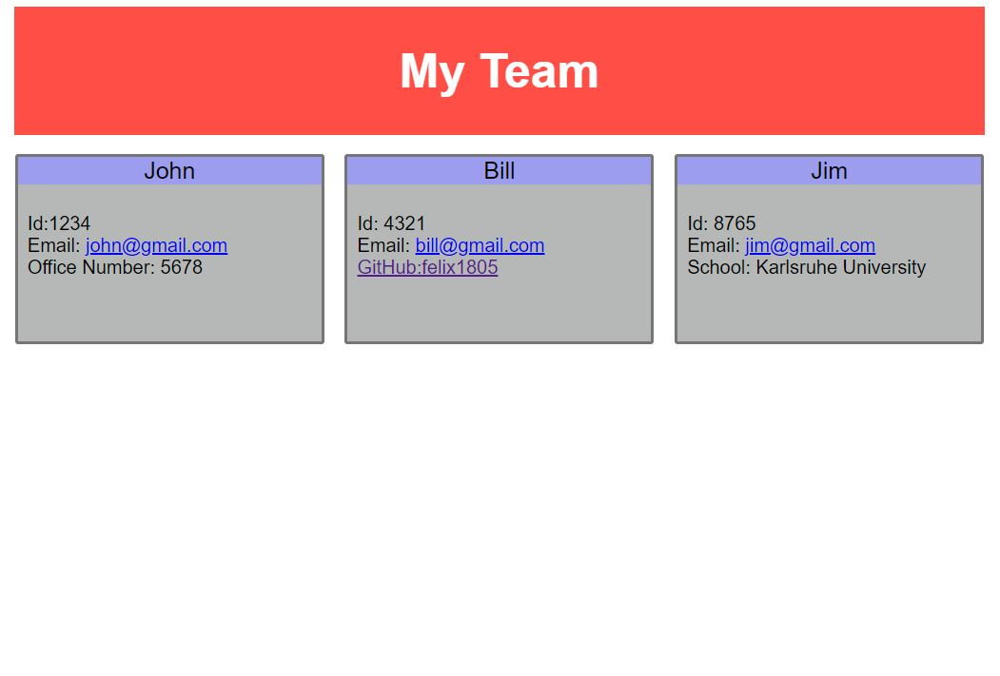
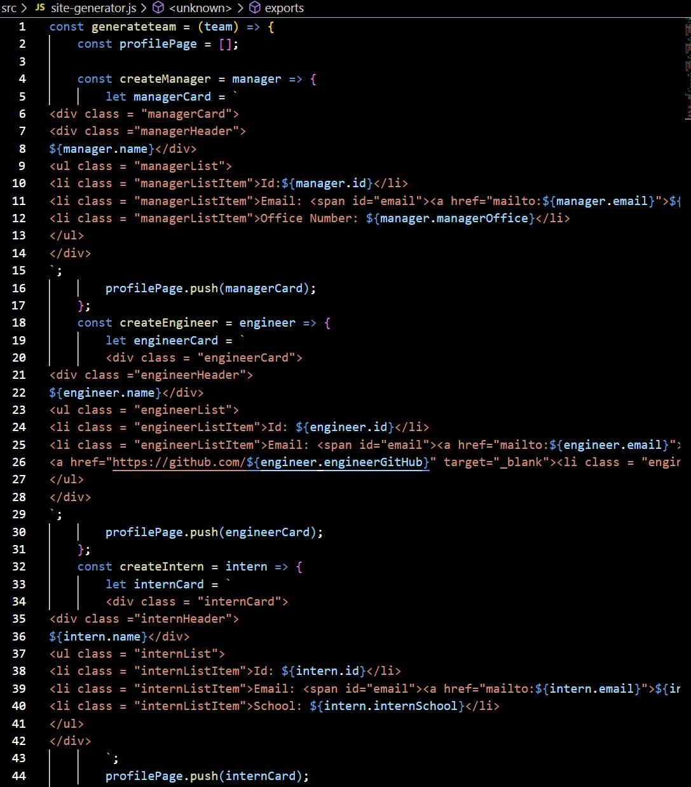

# Team-Profile-Generator

## Description

This project required constructing a team profile generator that utilizes a command line application to take in specific employee information for a manager, along with a team of engineers and interns. The information collected is targeted toward each employee group, taking in GitHub information for engineers, along with an office number for the manager and school information for interns. 
This information is then pushed to and html file that generates with the above information on an easy to read web page. 

## Table of Contents

- [Description](#description)

- [Installation](#installation)

- [Usage](#usage)

- [Contributors](#contributors)

- [Technology](#technology)

- [Links](#Links)

## Installation

This program using a node.js system that requires specific node package management. Thus once the repository has been downloaded, a user must run "npm init" in the command console to install npm on a machine. Once this command has been completed, "npm install inquirer" needs to run to install the specific inquirere modules. Once all npm specific components have been installed, the program can be initialized and ran using the "node index.js" command in the console. After answering all questions, the user will then receive a custom HTML file that will deploy in the "dist" folder of the application tree. 

## Usage

This program was designed to be used in order to easily generate an html file with employee specific information for a team of software engineers, interns and their manager. 

Usage and Code Examples:

## Contributors

[Felix Petzsche GitHub Link](https://felix1805.github.io/Team-Profile-Generator/).

## Technology

This application uses javascript, JEST, HTML, node.js scripting, node package management and inquirer. 

## Links

[Deployed Youtube Link](https://youtu.be/zr4GOgZSrRM)

